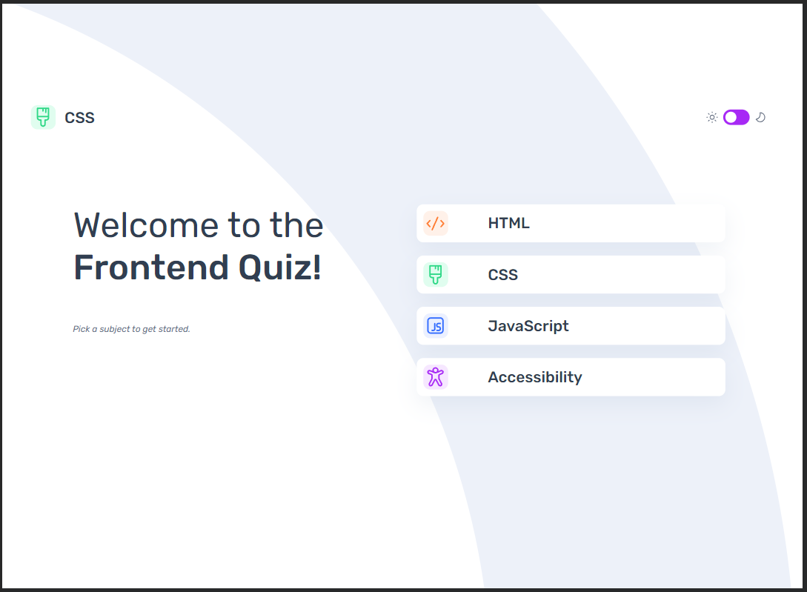
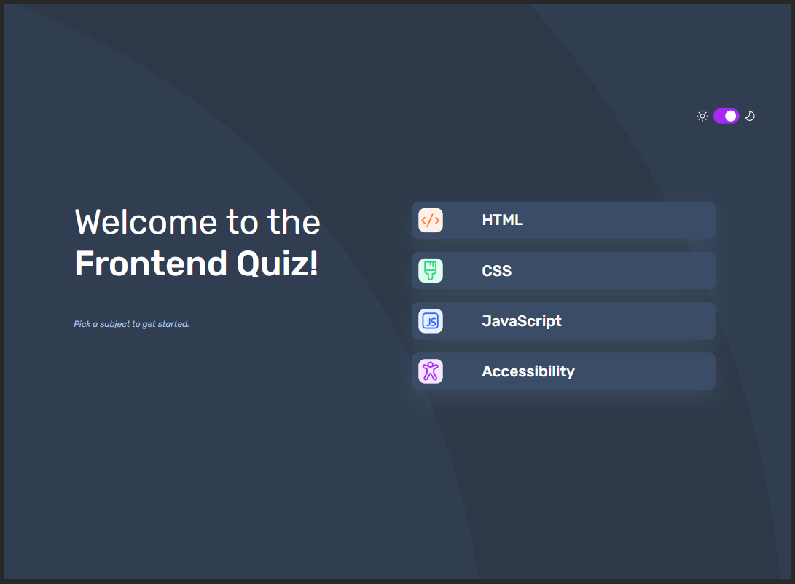
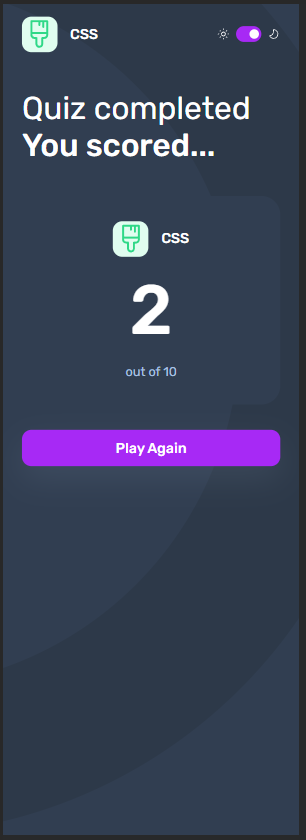
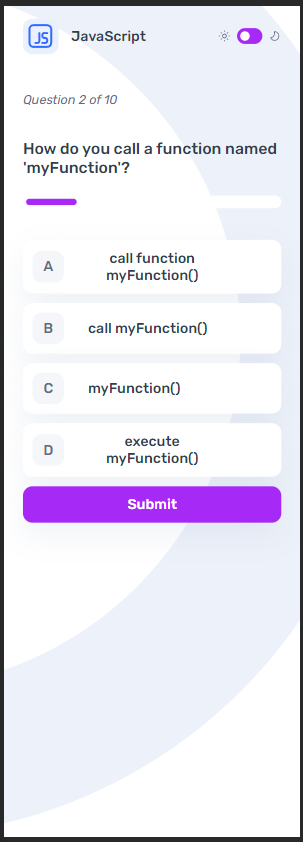

# Frontend Mentor - Frontend quiz app solution

This is a solution to the [Frontend quiz app challenge on Frontend Mentor](https://www.frontendmentor.io/challenges/frontend-quiz-app-BE7xkzXQnU). Frontend Mentor challenges help you improve your coding skills by building realistic projects. 

## Table of contents

- [Overview](#overview)
  - [The challenge](#the-challenge)
  - [Screenshot](#screenshot)
  - [Links](#links)
- [My process](#my-process)
  - [Built with](#built-with)
  - [What I learned](#what-i-learned)
  - [Continued development](#continued-development)
  - [Useful resources](#useful-resources)
- [Author](#author)

## Overview

### The challenge

Users should be able to:

- Select a quiz subject
- Select a single answer from each question from a choice of four
- See an error message when trying to submit an answer without making a selection
- See if they have made a correct or incorrect choice when they submit an answer
- Move on to the next question after seeing the question result
- See a completed state with the score after the final question
- Play again to choose another subject
- View the optimal layout for the interface depending on their device's screen size
- See hover and focus states for all interactive elements on the page
- Navigate the entire app only using their keyboard
- **Bonus**: Change the app's theme between light and dark

### Screenshot






### Links

- Solution URL: [Solution URL](https://github.com/rainSaxFrontend-Mentor-Projects/frontend-quiz-app)
- Live Site URL: [Live site URL](https://rainsaxfrontend-mentor-projects.github.io/frontend-quiz-app/)

## My process

### Built with

- Semantic HTML5 markup
- CSS custom properties
- Flexbox
- CSS Grid
- Mobile-first workflow

### What I learned

In doing this project I got a ton of practice with javascript and CSS. One of the biggest new things I learned was how to retrive data from a .json file. This involved learning and working with fetch(), Promises, await, and .json(), all of which were new to me. Another new approach I got more comfortable with was the practice of creating a class in CSS such as .visible, and having js simply toggle that class on and off when appropriate. This was my refactored approach to each of the quiz screens and through the CSS I was able to delegate .visible's activities via media queries.

```js
async function getQuiz(type) {
    const response = await fetch('./data.json');
    const data = await response.json();
    for (const quiz of data.quizzes) {
        if (quiz.title == type) {
            quizChosen = quiz;
            totalQuestions = quizChosen.questions.length;
            document.querySelector(".question-total").textContent = totalQuestions
            increment = (1 / totalQuestions) * 100;
        }
    }
    makeQuestions(quizChosen)
}
```

### Continued development

I think it will be fun to continue working on this assignment as an on going project. For the future, I plan to add difficulty levels with different sets of questions. The program already allows for a variable number of questions.

### Useful resources

- [fetch with json](https://dmitripavlutin.com/fetch-with-json/) - This helped me understand how to use await, fetch, and .json()

## Author

- Frontend Mentor - [@rainSax](https://www.frontendmentor.io/profile/rainSax)
